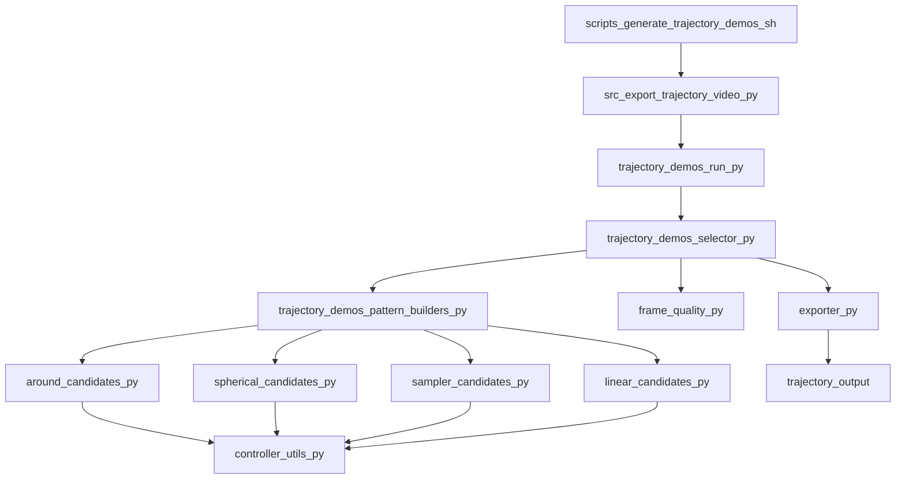

# Trajectory Demo Engine

## Purpose

This package is the AI2-THOR trajectory demo engine that generates the curated videos in `trajectory_output/`.

It answers two practical questions:

1. Which Python file most directly controls each video type?
2. How does the full demo engine work from CLI call to final `video.mp4`?

## Directory Map

Representative file tree:

```text
src/trajectory_demos/
├── run.py
├── run.sh
├── pattern_builders.py
├── around_candidates.py
├── spherical_candidates.py
├── linear_candidates.py
├── sampler_candidates.py
├── selector.py
├── frame_quality.py
├── controller_utils.py
├── exporter.py
├── demo_config.py
├── trajectory_candidate.py
├── pose_record.py
├── scene_selection.py
└── pattern_helpers.py
```

What each file does:

- `run.py`: CLI defaults and config plumbing for the demo engine.
- `run.sh`: thin shell wrapper that runs `python -m trajectory_demos.run`.
- `pattern_builders.py`: dispatches a trajectory slug to the correct candidate builder.
- `around_candidates.py`: builds safe horizontal orbit candidates.
- `spherical_candidates.py`: builds spherical-style demo paths on top of safe orbit geometry.
- `linear_candidates.py`: builds deterministic `approach_*` and `passby_*` paths.
- `sampler_candidates.py`: builds the room rotation candidates.
- `selector.py`: scores all candidates and chooses the final object per trajectory.
- `frame_quality.py`: image-space quality checks used by the selector.
- `controller_utils.py`: AI2-THOR controller setup, reset, teleport, and metadata helpers.
- `exporter.py`: renders frames, writes manifests, and encodes `video.mp4`.
- `demo_config.py`: shared config dataclass and trajectory name list.
- `trajectory_candidate.py`: immutable candidate record passed through selection/export.
- `pose_record.py`: single pose container used by the exporter.
- `scene_selection.py`: selected scene plus chosen trajectory set.
- `pattern_helpers.py`: small pose/config helpers shared across builders.

## Control File By Video Type

These are the most important Python control files for each demo type.

| Video type | Primary control file | Most important function | Notes |
|---|---|---|---|
| `around_cw` | `src/trajectory_demos/around_candidates.py` | `build_around_candidates()` | Builds reachable horizontal orbit arcs. |
| `around_ccw` | `src/trajectory_demos/around_candidates.py` | `build_around_candidates()` | Same builder as clockwise, reversed direction. |
| `spherical_cw` | `src/trajectory_demos/spherical_candidates.py` | `build_spherical_candidates()` | Uses a safe orbit path, then varies height to make a spiral-like spherical demo. |
| `spherical_ccw` | `src/trajectory_demos/spherical_candidates.py` | `build_spherical_candidates()` | Same spherical builder, reversed direction. |
| `rotation_cw` | `src/trajectory_demos/sampler_candidates.py` | `build_rotation_candidates()` | Delegates to the multiview sampler's room-rotation logic. |
| `rotation_ccw` | `src/trajectory_demos/sampler_candidates.py` | `build_rotation_candidates()` | Same room-rotation builder, reversed direction. |
| `approach_fw` | `src/trajectory_demos/linear_candidates.py` | `_approach_poses()` | Fixed-heading straight-line move toward the object. |
| `approach_bw` | `src/trajectory_demos/linear_candidates.py` | `_approach_poses()` | Same approach path, reversed playback direction. |
| `passby_fw` | `src/trajectory_demos/linear_candidates.py` | `_passby_poses()` | Fixed-heading lateral sweep past the object. |
| `passby_bw` | `src/trajectory_demos/linear_candidates.py` | `_passby_poses()` | Same pass-by path, reversed direction. |

Important cross-cutting control files:

- `src/trajectory_demos/pattern_builders.py`: first routing layer from trajectory name to builder.
- `src/trajectory_demos/selector.py`: decides which object candidate becomes the final demo clip.
- `src/trajectory_demos/exporter.py`: turns the chosen poses into images, manifests, and MP4 files.
- `src/trajectory_demos/controller_utils.py`: the AI2-THOR execution layer.

## How The Engine Works

The engine is AI2-THOR-only at runtime.

It does not render with InteriorGS. Some geometry ideas for the linear demos were adapted from the separate InteriorGS pipeline, but the actual demo rendering path here is AI2-THOR.

High-level flow:



Detailed step-by-step behavior:

1. `scripts/generate_trajectory_demos.sh` starts the pipeline in Docker and forwards CLI flags such as `--scene`, `--fps`, `--min_frames`, and `--output_dir`.
2. `src/export_trajectory_video.py` is only a thin wrapper that calls `trajectory_demos.run.main()`.
3. `src/trajectory_demos/run.py` parses CLI args into `TrajectoryDemoConfig`.
4. `src/trajectory_demos/run.sh` is the direct non-Docker shell wrapper for `run.py` when you want to launch the package entrypoint itself.
5. `src/trajectory_demos/selector.py` chooses a scene and one final candidate per trajectory.
6. `src/trajectory_demos/pattern_builders.py` routes each trajectory slug to its candidate builder.
7. Candidate builders generate pose sequences:
   - `around_candidates.py`: safe XY orbit arc using reachable points.
   - `spherical_candidates.py`: same safe orbit footprint, but with varying height to create the spherical-style view path.
   - `sampler_candidates.py`: room-center rotation path.
   - `linear_candidates.py`: deterministic straight-line approach and pass-by motion.
8. `src/trajectory_demos/controller_utils.py` runs AI2-THOR:
   - create controller
   - reset scene
   - crouch camera
   - get reachable positions
   - teleport to each candidate pose
9. `src/trajectory_demos/frame_quality.py` and `selector.py` score candidates using:
   - object visibility
   - 2D bbox availability
   - bbox area ratio
   - bbox center position
   - longest contiguous valid pose run
   - pattern-specific quality signals
10. `src/trajectory_demos/exporter.py` renders only the selected poses, writes `frames/frame_*.png`, writes per-trajectory `manifest.json`, writes `curated_manifest.json`, and calls `ffmpeg` to encode `video.mp4`.

## Where The Safe Motion Comes From

The current demo engine mixes three sources of logic:

- Safe orbit ancestry:
  - `src/trajectory_demos/around_candidates.py`
  - mirrors the reachable-orbit logic from `src/scene_edits/movearound_editor.py`
- AI2-THOR room rotation:
  - `src/trajectory_demos/sampler_candidates.py`
  - delegates to `src/multiview_qa_gen/camera_sampler.py`
- InteriorGS-inspired linear geometry:
  - `src/trajectory_demos/linear_candidates.py`
  - borrows the idea of deterministic straight-line trajectories, but still runs in AI2-THOR

In other words:

- `around` is AI2-THOR safe-orbit logic.
- `spherical` is a safe-orbit-based spiral demo.
- `rotation` is AI2-THOR room-center rotation.
- `approach` and `passby` are deterministic demo paths rendered in AI2-THOR.

## Output Directory Schema

Representative output structure:

```text
trajectory_output/
├── curated_manifest.json
└── FloorPlan203/
    ├── around_cw_Chair/
    │   ├── frames/
    │   │   ├── frame_00000.png
    │   │   └── ...
    │   ├── video.mp4
    │   └── manifest.json
    ├── spherical_cw_Chair/
    ├── rotation_cw_room/
    ├── approach_fw_FloorLamp/
    └── passby_fw_DiningTable/
```

`curated_manifest.json` schema:

- `scene`: selected scene name
- `trajectory_count`: number of exported trajectories
- `total_saved_frames`: sum of all retained frames across the curated set
- `config`: top-level generation settings
- `trajectories`: per-trajectory summary

Per-trajectory `manifest.json` schema:

- `scene`: scene name
- `trajectory`: trajectory slug, such as `around_cw`
- `object_id`: selected AI2-THOR object id, or `room`
- `object_type`: selected object type, or `room`
- `radius`: nominal path radius
- `arc_degrees`: requested arc span
- `increment`: angular increment
- `fps`: video playback rate
- `total_poses`: total generated poses before filtering
- `saved_frames`: number of retained frames exported
- `field_of_view`: AI2-THOR camera FOV
- `image_size`: rendered square resolution
- `pose_source`: which builder produced the final path
- `video_path`: final MP4 path

## If You Need To Change Behavior

Most common edit points:

- Change CLI defaults: `src/trajectory_demos/run.py`
- Change Docker entry behavior: `scripts/generate_trajectory_demos.sh`
- Change which file controls a trajectory slug: `src/trajectory_demos/pattern_builders.py`
- Change orbit behavior: `src/trajectory_demos/around_candidates.py`
- Change spherical behavior: `src/trajectory_demos/spherical_candidates.py`
- Change approach/pass-by behavior: `src/trajectory_demos/linear_candidates.py`
- Change quality filtering or object selection: `src/trajectory_demos/selector.py`
- Change bbox scoring: `src/trajectory_demos/frame_quality.py`
- Change AI2-THOR controller behavior: `src/trajectory_demos/controller_utils.py`
- Change file writing or MP4 export: `src/trajectory_demos/exporter.py`
